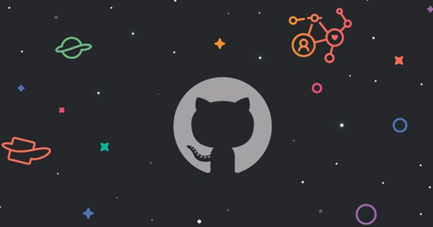

<div align="center">



# GitGrimoire 🍀

**Every mage is chosen by a Grimoire. Every developer deserves one too.**

Type any GitHub username and receive a Grimoire forged from real commits, streaks,
pull requests, and stars — a Black Clover-inspired Magic Knight profile for developers.
No sign-in, no OAuth. Just a username, gitfut-style.

[](https://github.com/tosxin-456/gitgrimoire/stargazers)
[](https://github.com/tosxin-456/gitgrimoire/fork)

**[🔮 Summon your Grimoire →](https://gitgrimoire.vercel.app)** ·
[⚔️ Duel a rival](https://gitgrimoire.vercel.app/duel) ·
[👑 Leaderboard](https://gitgrimoire.vercel.app/leaderboard)

</div>

---

## ✨ What you get

- **A 3D grimoire book** — not a flat card. It arrives sealed; tap it and the cover flips open (CSS 3D + Framer Motion) into a two-page spread with your avatar, rank, squad, attribute, and six FIFA-style stats. Export it as a PNG and share it.
- **A cinematic summoning ceremony** — fade to black, particles, magic circles, the book descends, pages turn, light floods the screen… then your grimoire chooses you.
- **A duel arena** — pit two GitHub users against each other. Their covers charge and clash with attribute-colored auras, spell bolts, and impact sparks before the verdict lands. The winner is decided deterministically by real stats, never randomness.
- **Leaderboards** — Top Mana, Top Captains, Wizard King Candidates, Highest Overall, Longest Streak, Most Powerful Grimoires.

## 🧙 How I built it

The whole app is one pipeline: **GitHub GraphQL → scoring engine → SQLite → themed presentation.**

### 1. No OAuth — just a username

Visitors never authorize anything. A single server-side, **no-scope** GitHub token reads public
profile data through the GraphQL API ([`src/lib/github.ts`](src/lib/github.ts)): profile, repos,
languages, topics, organizations — plus a year-by-year `contributionsCollection` loop to compute
all-time commit totals and contribution streaks (the REST API only gives you one year at a time).

### 2. The scoring engine

[`src/lib/scoring/`](src/lib/scoring) turns raw stats into six 1–99 card stats. Each stat draws
from a *different slice* of GitHub activity, so no single metric dominates the card:

| Stat | Forged from |
| --- | --- |
| **Mana** | total commits (50%) · current streak (30%) · active days (20%) |
| **Spell Mastery** | stars received (65%) · top-language dominance (35%) |
| **Battle Experience** | account age (40%) · PRs + issues closed (35%) · public repos (25%) |
| **Leadership** | followers (50%) · organizations (30%) · PR merge ratio (20%) |
| **Control** | longest streak (50%) · merge ratio (30%) · issues closed (20%) |
| **Potential** | contribution velocity per year (60%) · current streak (40%) |

Raw counts pass through a log-style `scale()` curve — the climb from 0 → 1,000 commits moves you
far more than 10,000 → 11,000, so newcomers aren't flattened by legends. The weighted blend of all
six becomes your **Overall Rating (50–99)**, which maps onto the Magic Knight ladder:

```
98+  Wizard King            82+  Captain
93+  Wizard King Candidate  76+  Vice Captain
88+  Grand Magic Knight     69+  Senior Magic Knight  …down to Unranked
```

### 3. Attribute, Squad, and Rarity

- **Magic Attribute** comes from what you actually build: your dominant language maps to an element
  (JavaScript → Lightning, TypeScript → Time, Rust → Steel, Go → Wind, Python → Spatial…), but repo
  *topics* can override it — enough security repos make you a Dark mage, ML work leans Dream Magic,
  game dev is Creation Magic.
- **Squad** is assigned by development style — disciplined streaks, raw output, community pull —
  each mapping to one of the nine Magic Knight squads with its own colors and tagline.
- **Rarity** is overall-driven — Common → Bronze → Silver → Gold → Three-Leaf → **Four-Leaf** —
  and it caps there: even the kingdom's strongest legends carry a four-leaf clover. The
  **Five-Leaf** cannot be earned, rolled, or bought. It chose exactly one person — the magic-less
  founder, whose only power is that he never gives up. 😈
- **Duels** ([`src/lib/scoring/duel.ts`](src/lib/scoring/duel.ts)) resolve by Overall → combined
  stats → stars → commits, so a duel URL always resolves the same way and true mirror matches draw.

### 4. The presentation layer

Everything visual is hand-built with **Tailwind CSS v4 + Framer Motion** — no UI kit:

- The book is two faces in a CSS `perspective` scene; the cover is a `motion.button` rotating on
  `rotateY` with its spine as the transform origin, styled per-rarity (the Four-Leaf gets Yuno's
  mossy watercolor, the Five-Leaf gets scorched leather and an ember halo).
- The ceremony and the duel are phase machines: `setTimeout`-driven phases drive keyframe arrays
  on one shared timeline (lunges, screen shake, impact flashes all share the same `times`), with
  `prefers-reduced-motion` skipping straight to the result.
- PNG export renders the open spread through [`html-to-image`](https://github.com/bubkoo/html-to-image) at 2× pixel ratio.

### 5. Persistence

Summons are upserted via **Prisma** into SQLite ([`prisma/schema.prisma`](prisma/schema.prisma)) —
local file in dev, **Turso (libSQL)** in production — which powers the leaderboards, permanent
profile URLs (`/grimoire/<username>`), and rank-promotion messages when you return stronger.

## 🛠 Run it locally

**1. Create a server-side GitHub token** — [github.com/settings/tokens](https://github.com/settings/tokens) → *Generate new token (classic)* → select **no scopes** (public data only).

**2. Configure the environment** — copy `.env.example` to `.env`:

```bash
GITHUB_TOKEN=your_server_side_token
```

`DATABASE_URL` already points at a local SQLite file. On Vercel, set `GITHUB_TOKEN` plus
`TURSO_DATABASE_URL` / `TURSO_AUTH_TOKEN` in the project's environment variables.

**3. Install and run:**

```bash
npm install
npx prisma migrate dev   # first time only — creates prisma/dev.db
npm run dev
```

Open [http://localhost:3000](http://localhost:3000) and summon someone.

## 🧰 Tech stack

**Next.js 16 (App Router)** · **TypeScript** · **Tailwind CSS v4** · **Framer Motion 12** · **Prisma + SQLite / Turso** · **GitHub GraphQL API**

## ⭐ Star history

If GitGrimoire made you smile — or your grimoire came out Five-Leaf — **star the repo**. It's how
other mages find the kingdom.

<a href="https://www.star-history.com/#tosxin-456/gitgrimoire&Date">
 <picture>
   <source media="(prefers-color-scheme: dark)" srcset="https://api.star-history.com/svg?repos=tosxin-456/gitgrimoire&type=Date&theme=dark" />
   <source media="(prefers-color-scheme: light)" srcset="https://api.star-history.com/svg?repos=tosxin-456/gitgrimoire&type=Date" />
   
 </picture>
</a>

<div align="center">

*Built by [@tosxin-456](https://github.com/tosxin-456) — powered by real GitHub deeds.*

**[gitgrimoire.vercel.app](https://gitgrimoire.vercel.app)**

</div>
